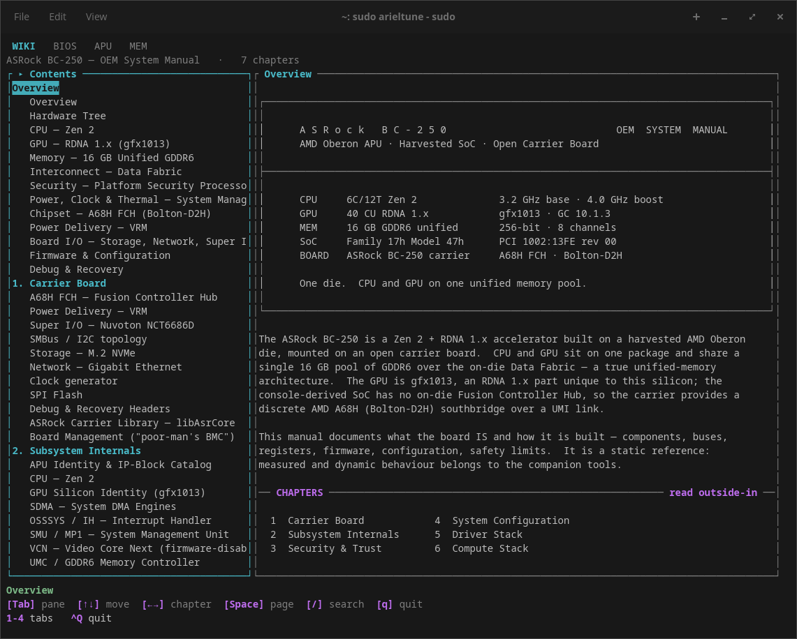
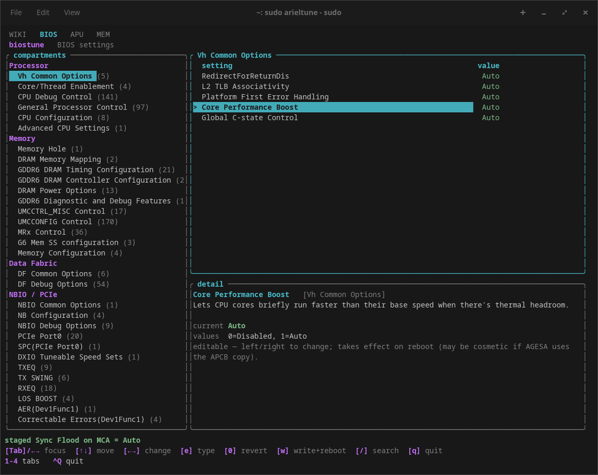
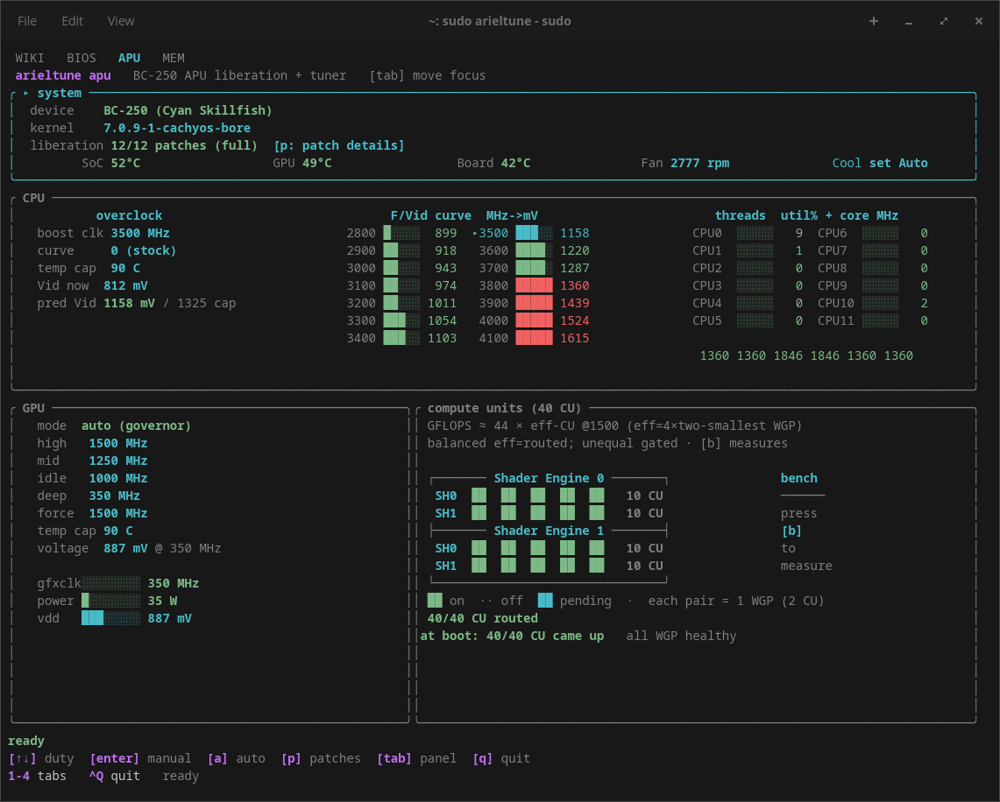
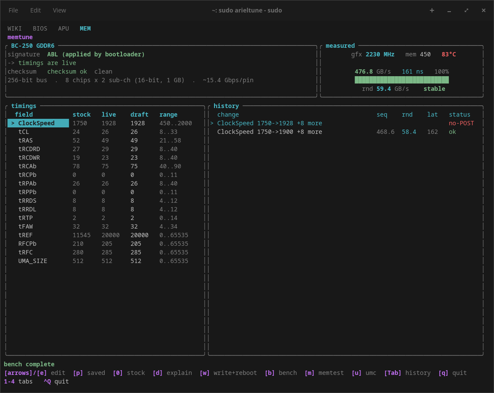

# arieltune

Unified BC-250 tuning suite -- one tabbed TUI over the four BC-250 tools:

```
WIKI | BIOS | APU | MEM
```

- **WIKI** -- the BC-250 knowledge manual.
- **BIOS** -- the AMD CBS + OEM Setup surface.
- **APU**  -- APU liberation + CPU/GPU/CU tuner.
- **MEM**  -- GDDR6 memory-timing tuner.

"Ariel" is the AMD codename of the APU silicon (the BC-250's Cyan Skillfish / gfx1013
part), so the suite is named for the chip, not the board. Primary target is the
BC-250; the detection seam is APU-family-first so a PS5-on-Linux profile can be added
later.

## Screenshots

<table>
  <tr>
    <td align="center"><b>WIKI</b> - the BC-250 manual<br></td>
    <td align="center"><b>BIOS</b> - CBS + OEM Setup<br></td>
  </tr>
  <tr>
    <td align="center"><b>APU</b> - liberation &amp; CPU/GPU/CU tuning<br></td>
    <td align="center"><b>MEM</b> - GDDR6 memory timings<br></td>
  </tr>
</table>

## Usage

```
arieltune              # launch the TUI at the default tab (WIKI, or config default_tab)
arieltune apu          # launch the TUI focused on the APU tab
arieltune --tab mem    # launch the TUI focused on the MEM tab
arieltune apu <cmd>    # run the APU CLI (namespaced per app)
```

Inside the TUI: `1`-`4` jump to WIKI/BIOS/APU/MEM (`F1`-`F4` also work), `Ctrl-Tab` cycles, `Ctrl-Q` quits.
Bare `Tab`/`q` belong to the active tab.

## Status

Functional: the tabbed TUI shell plus all four tabs (WIKI/BIOS/APU/MEM) and their
per-app CLIs are wired and usable on a BC-250.

## Requirements / Safety

- A real **BC-250** (or an Ariel-APU board) - the tuners read and write that
  specific silicon.
- **root** for any actuation (SMU mailboxes, CMOS/NVRAM, SPI flash, sysfs writes).
- A **patched amdgpu** for the APU-liberation features (see the APU tab / patch
  series).
- **arieltune must be the *only* thing driving the SMU.** The APU tab talks to the
  GPU/CPU power silicon over the single SMU (MP1) mailbox. If a second actuator is
  poking that mailbox too, the two race - you get crippled throughput, wrong clocks,
  or a wedged GPU that needs a power-cycle.

**Install on a fresh Linux, or remove competing clock/power controllers first.**
Before running the APU tab, tear out anything else that touches BC-250 clocks,
voltages, or the SMU:

- old BC-250 SMU daemons / scripts - `dpm_daemon`, `bc250_smu`, hand-rolled
  `ForceGfxFreq` / `pp_od_clk_voltage` cron jobs, vendor "miner" clock tools;
- generic GPU/CPU overclock or governor tools pinned to this box (custom
  `amdgpu` OD scripts, corectrl profiles, tuned/cpupower governors forcing clocks).

Disable and remove those units/scripts (and reboot to clear any clock they pinned)
so arieltune's `arieltune-gpu.service` is the sole SMU governor. On a clean install
there's nothing to remove - that's the easiest starting point.

The APU, MEM, and BIOS features **write hardware** (SMU registers, CMOS/NVRAM, SPI
flash) and some changes require a reboot to take effect or to recover. A bad value
can fail to POST and need a power-cycle or CMOS-clear. **Use at your own risk.**

## Install

The quickest path - build and install in one step (needs a Rust toolchain from
[rustup.rs](https://rustup.rs) and `sudo` to install):

```
./install.sh                 # build (release) + install to /usr/local/bin
./install.sh --with-units    # also lay the APU GPU/route systemd units
./install.sh --with-driver   # also build the BIOS smiflash DKMS driver (needs a board)
```

This installs one binary (`arieltune`) plus a short `at` alias and
`aputune`/`memtune`/`biostune`/`wikitune` compat symlinks. `make install` and
`make uninstall` do the same via the Makefile.

### Build only

```
cargo build --release        # or: make build
```

Build on a modern x86-64 host; deploy to the BC-250 host by copy + install (same
arch/glibc). `make check` runs the full local gate (fmt + clippy + tests).

## The liberation patches (amdgpu)

The APU tab's headline features - the **full 40-CU unlock**, race-free clock
control, CPU clock limits, and live telemetry - need a **patched `amdgpu`**. The
stock driver keeps the BC-250 at its harvested-24-CU, locked-clock factory config
and exposes no safe way to drive the SMU. arieltune ships the kernel patch series
that changes that and builds it for you.

### How they work

The series is **12 curated GPL-2.0 diffs** (`01`-`12`) against the AMD
`amdgpu`/SMU code (`crates/apu/patches/bc250-cachyos-7.0.9/`), authored on
`linux-cachyos-bore-7.0.2` and structurally identical up through **7.0.9**, the
pinned known-good kernel. In short, they:

- **Unlock all 40 CUs** (`12`) - adds `amdgpu.bc250_cc_write_mode`, which
  reprograms the CU/SPI/RLC masks so the shader arrays the factory fused off come
  back. Default-off; gated on the BC-250 PCI id (`1002:13FE`).
- **Add a race-free SMU path** (`01`-`03`, `07`/`08`) - declares the extra
  `SMU_MSG_*` message ids, maps them, raises `SCLK_MAX` 2000→2500, and exposes an
  `amdgpu_smu_send_raw` debugfs node so arieltune can `ForceGfxFreq` /
  `deep-sleep` / `wake` the GPU **through the driver's own lock** instead of racing
  its MP1 polling.
- **CPU clock limits** (`09`) - `cclk_soft_min/max` debugfs.
- **Telemetry** (`04`/`05`/`11`) - starts PMFW reporting and adds nodes for
  live clocks, temperature, pstates and voltages.

> **Pin to `linux-cachyos-bore-7.0.9`.** Don't build the series against `7.0.11+`
> yet - those kernels regress the BC-250 SDMA path.

Experimental/footgun patches (raw-msgid pokes, power-brake DiDT, in-kernel DPM,
UMC wiring) are **deliberately excluded** - see
[`SERIES.md`](crates/apu/patches/bc250-cachyos-7.0.9/SERIES.md) for the full list
and rationale. Being kernel-derived, the patches are **GPL-2.0**, the same license as the
rest of the suite (see the patch dir's `NOTICE`).

### Installing them

arieltune drives the whole kernel build/deploy - you don't apply diffs by hand. It
runs the CachyOS `makepkg` flow: extract + prepare the kernel source, apply the
series, rebuild the package (`CC=gcc-15`), install it, lay the modprobe.d drop-in
that arms 40-CU, rebuild initramfs, and reboot. It's a **~30-minute kernel build
and a reboot**, so it always **previews the plan first** and only executes with
`--run`.

Run it **as your normal user, not under `sudo`** - `makepkg` refuses to run as
root, and arieltune self-elevates (`sudo`) only for the install / modprobe /
initramfs / reboot steps that actually need it.

```sh
# Guided: gate the board, show the patch report, pick a tier, then build.
arieltune apu liberate                  # preview (does nothing)
arieltune apu liberate --run            # actually build + install + reboot

# Or the direct build (skip the guided tier prompt):
arieltune apu build --run

# Build here, install onto a BC-250 over SSH (the target's user needs sudo):
arieltune apu build --target user@bc250-host --run
```

Requirements for the build host: the **CachyOS kernel PKGBUILD** (point at it with
`--pkgbuild <dir>` or `$APUTUNE_PKGBUILD`), the base-devel/makepkg toolchain, and
`gcc-15`. After the reboot the APU tab (`arieltune apu`) shows the freed CUs and
the live clock/telemetry that the stock driver can't. `arieltune apu liberate`
without `--run` is always safe - it just gates the board and prints what it *would*
do.

## Acknowledgments

arieltune stands on prior BC-250 community work. With thanks:

- **the bc250-collective** (**mrfrakes** and **dantistnfs**) for starting the BC-250
  effort - the original board bring-up, SMU mailboxing, and enablement groundwork that
  everything here builds on.
- **duggasco** for the CU-unlock research - the 40-CU enumeration/dispatch investigation
  on Cyan Skillfish.
- **WinnieLV** for the BC-250 live CU manager, whose proven `apply_target_masks` register
  sequence this project ports (`crates/apu/src/curoute.rs`).
- **ethkey** for sharing the memory-timing tool and timing configurations the **MEM** tab
  is built on; the ASRock `bc250_memcfg` tool and the RobinMemTiming work for the CMOS
  layout and timing semantics; and **walkjivefly** for taking the first plunge.

Building on that, we contribute our **CU map** back to the commons - the shader-array
topology and the empirical dispatch model (`effective_CU = 4 × the two smallest
per-array WGP`) that predicts real throughput from a CU routing. See
[`docs/bc250-cu-map.md`](docs/bc250-cu-map.md).

## License

**GPL-2.0-only** for the entire suite. The kernel-derived subtrees
(`crates/apu/patches`, `crates/apu/kmod/nct6687-bc250`, `crates/bios/driver`) were always
GPL-2.0, as they derive from the Linux kernel; their NOTICE files remain as upstream-provenance
and attribution records. See [`LICENSE`](LICENSE).

